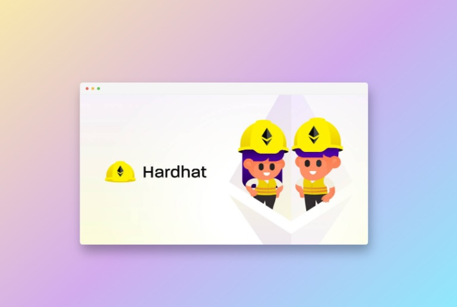

# Template for Solidity auditing and POCs building

## 

This is a **simple boilerplate using Hardhat and Typescript** for people looking to have an already working (and updated) template for their **audits / POCs**.

Although you can use this to develop Dapps, it is not optimized for it and you might want to install several other dependencies, change config files and so on.

But for just setting up a project, some contracts or building a quick POC it is perfect.

It has some cool features like:

- **🪄 Minimal and updated:** I tried to keep this repo updated with the latest stable libraries and settings so you don't have to worry on making this boilerplate work
- **👷‍♂️ Typed:** It uses Typescript and it even generates types for the contracts when compiling them, so you can use their functions with Intellisense in your scripts
- **🐈 Linted:** It has Prettier configured both for your script files and your contract files
- **🪟 Cross-platform:** Don't be worried about why a command doesn't work in your OS. I focus on making this "1-click to run" in main OS!
- **🔌 Plugins ready:** Now you don't have to worry about which plugins you should use. You will be prompted with the recommended auditing plugins in case you don't have them.
- **⛽ Gas report:** In case you want to test the gas used by some functions, you can get a detailed report
- **🔥 VS Code Integrated:** Launch your Hardhat local node by just launching it from the VS Code debug section

## 🔧 Installation

1. Clone this repository or click in the "" button in this repository:

```bash
git clone
```

2. Open it in the terminal and instal the node modules:

#### With NPM

```bash
npm i
```

#### With Yarn

```bash
yarn
```

## ⛽ Enabling the Gas Report feature (optional)

If you want to use the gas report feature, you need to create a .env file like this:

```bash
cp .env.example .env
```

Then, set the var `REPORT_GAS` as `TRUE` and [get a CoinMarketCap API key](https://coinmarketcap.com/api/documentation/v1/). Set that API key in the var `COINMARKETCAP_API_KEY`.
Now you are ready!

## ⚒️ Functions and Tools included

### 🏗️ Compile

Compile your contracts (and generate automatically their types) by running:

```bash
npx hardhat compile
```

or

```bash
yarn compile
```

### 🔗 Scripts

Run any script you coded with:

```bash
npx hardhat run <script path>
```

or

```bash
yarn run <script path>
```

### 🧪 Run tests

Run your Hardhat tests with:

```bash
npx hardhat test
```

or

```bash
yarn test
```

### 🪟 Launch your local Node

Launch a local blockchain node by launching it from the VS Code debug panel or:

```bash
yarn node
```

### ⛽ Get a gas report

If you have configured the gas report settings, just run this command and it will generate a gas report for the contract functions tested in your test files:

```bash
yarn gas
```

### 🤔 Having issues?

If you have any issue, try cleaning the project by running:

```bash
yarn clean
```

### 📝 Auto fix formats

Apply automatically all the formatting settings in all your files by running:

```bash
yarn format:fix
```

## 🔌 VS Code Recommended Extensions

These are the extensions the template will recommend you:

- **Prettier**: [Marketplace docs](https://marketplace.visualstudio.com/items?itemName=esbenp.prettier-vscode)
- **Solidity by Juan Blanco**: [Marketplace docs](https://marketplace.visualstudio.com/items?itemName=JuanBlanco.solidity)
- **Solidity Visual Developer**: [Marketplace docs](https://marketplace.visualstudio.com/items?itemName=tintinweb.solidity-visual-auditor)
- **Slither**: [Marketplace docs](https://marketplace.visualstudio.com/items?itemName=trailofbits.slither-vscode)

## 🏗️ Contributions

I am open for contributions in this repo but always remember the main goals of this repo:

- Simple to install and use
- Updated but without breaking previous functionality
- Targeted for auditors, not for developers
  If your contribution fits to those goals, thank you for helping to maintain this!

## ⚠️ Extra

- We are using Ethers 5.7.2 as a dependency. Right now the most updated version is 6.1.0 but several of the Hardhat libraries are not compatible yet with that version, so make sure to don't update it or it won't work!
